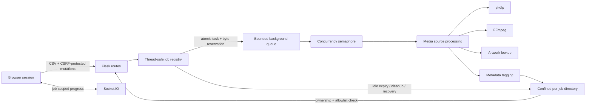

# Signal Forge

Signal Forge is a backend-focused Flask and Socket.IO application for isolated asynchronous media-processing jobs. A user imports a UTF-8 CSV track list, selects a bounded set of entries, and follows each job from admission through background processing to authorized file delivery.

The project began as personal automation and is presented publicly for its engineering architecture: session-scoped authorization, atomic resource admission, bounded concurrency, path-confined artifacts, real-time progress, cleanup/recovery semantics, and automated reliability/security tests.

> Use Signal Forge only for media you are legally permitted to download and process. Source-provider terms and copyright rules remain the user's responsibility. Search-based source selection may return a different recording from the one intended. Signal Forge is not affiliated with Spotify, YouTube, Apple, or any other media platform.

## Engineering highlights

- **Opaque isolated jobs.** Each browser session owns one random job ID. Song data, statuses, and file paths remain server-side.
- **Ownership-scoped access.** Job status, completed files, ZIP creation, cleanup, and Socket.IO room membership require ownership of the current job.
- **CSRF-protected mutations.** Mutating HTTP routes require a per-job HMAC CSRF token.
- **Atomic resource admission.** Task slots and conservative byte reservations are committed before background threads or output directories are exposed to new work.
- **Bounded resource usage.** The service applies request, CSV, selection, source-download, artifact, per-job, process-wide, ZIP, job-count, and concurrency ceilings.
- **Thread-safe lifecycle management.** Jobs move through explicit accepting/closing states, retain capacity while storage deletion occurs, and can be restored after cleanup failures.
- **Confined artifact delivery.** Filenames are generated by the server, validated against an allowlist, and constrained to the owning job directory.
- **Real-time progress.** Socket.IO sends job-scoped queue, download, conversion, success, and failure updates.
- **Failure cleanup.** Oversized files, source-limit failures, failed thread starts, and processing exceptions release reservations and remove partial outputs.
- **Testable external I/O.** The pytest suite uses temporary job roots and mocks media/network operations rather than downloading live content.

## Architecture



The source-processing implementation currently uses `yt-dlp`, FFmpeg, and an HTTPS artwork lookup. Those dependencies are deliberately kept behind the job/resource boundary rather than trusted with unbounded filesystem or request behavior.

## Runtime model

Jobs, ownership records, progress, rate limits, reservations, and concurrency controls are held in process memory. **Production must use exactly one worker.** Multiple application workers would maintain independent registries and would break ownership, progress, and capacity accounting.

The committed `Procfile` uses one Gunicorn `gthread` worker with four threads:

```text
web: gunicorn --worker-class gthread --workers 1 --threads 4 --bind 0.0.0.0:$PORT app:app
```

Job files live below `DATA_ROOT` in random per-job directories. Uploaded CSV bytes are parsed in memory and are not written to disk. Completed artifacts remain temporary and are not durable/private cloud storage.

Idle accepting jobs are opportunistically reaped after one hour by default. Queued, active, reserved, closing, and path-invalid jobs are not reaped. Storage deletion happens outside registry/job locks while the closing job continues to consume its slot and retained-byte capacity. If deletion fails, surviving allowlisted files are reconciled and the same job is restored for a later retry.

## Resource admission model

The defaults are intentionally finite:

| Limit | Default |
|---|---:|
| Request body | 2 MB |
| CSV bytes | 1 MB |
| CSV rows | 2,000 |
| Consumed field length | 500 characters |
| Selected tracks per request | 20 |
| Concurrent media operations | 2 |
| Queued/active tasks per job | 8 |
| Source media bytes | 100 MB |
| Final artifact bytes | 100 MB |
| Conservative reservation per admitted task | 100 MB |
| Retained artifacts per job | 500 MB |
| Process-local jobs | 100 |
| Process-wide retained + reserved bytes | 2 GB |
| Idle expiry | 1 hour |
| ZIP input | 250 MB |
| Artwork response | 5 MB |

A request that would exceed a per-job or process-wide ceiling is rejected as a whole before work is spawned. After processing, the conservative reservation is reconciled against the authoritative artifact size.

## Requirements

- Python **3.14.6** as declared in `.python-version`
- FFmpeg, either supplied by the pinned `imageio-ffmpeg` package or explicitly configured with `FFMPEG_PATH`
- Node.js only for the optional JavaScript syntax check used in CI

Runtime and development dependencies are directly version-pinned in `requirements.txt` and `requirements-dev.txt`.

## Local setup

```bash
python -m venv .venv
```

Activate it:

```bash
# Windows
.venv\Scripts\activate

# macOS/Linux
source .venv/bin/activate
```

Install development dependencies:

```bash
python -m pip install --requirement requirements-dev.txt
```

Optionally copy the safe environment template:

```bash
cp .env.example .env
```

On Windows PowerShell:

```powershell
Copy-Item .env.example .env
```

Start the local development server:

```bash
python app.py
```

The direct development server binds to `127.0.0.1` by default.

## Secret configuration

Development may omit `SECRET_KEY`; the application will generate an ephemeral key for that process and log a warning. Sessions will reset after restart.

Persistent or production deployments require a strong secret of at least 32 characters. Generate one locally:

```bash
python -c "import secrets; print(secrets.token_urlsafe(48))"
```

Store it in deployment/environment configuration. Never commit it.

## Configuration

| Variable | Purpose | Default |
|---|---|---|
| `SECRET_KEY` | Signs the opaque job cookie and per-job CSRF tokens | Ephemeral in development; required in production |
| `APP_ENV=production` | Enables production secret validation and secure cookies | Development |
| `DATA_ROOT` | Parent directory for isolated job folders | OS temp directory + application folder |
| `FFMPEG_PATH` | Optional executable override | Executable supplied by `imageio-ffmpeg` |
| `PORT` | Development/deployment port | `5000` |

Additional task, storage, TTL, and capacity limits can be changed through Flask configuration when embedding or testing the app. All capacity and TTL settings must remain positive.

## CSV format

Files must be UTF-8 with unique headers. `Song` and `Artist` are required. `Album` and `Genres` are optional. Other columns are ignored.

```csv
Song,Artist,Album,Genres
Midnight Drive,Nova Lines,Afterglow,"Electronic, Synthwave"
Paper Moons,The Low Signals,,Indie
```

Blank required fields, malformed quoting, excessive rows/bytes/field lengths, and extra values without headers are rejected before a replacement job is created.

## Verification

The test suite uses temporary job roots and mocks live network/media operations.

```bash
python -m pytest -q
python -m compileall -q app.py tests tools
node --check static/app.js
python tools/publication_guard.py
```

GitHub Actions also runs a dependency vulnerability audit with `pip-audit` before the test suite. CI is intentionally part of the publication contract rather than decorative green confetti.

The tests cover, among other things:

- production secret validation and secure cookies;
- CSV validation and upload limits;
- CSRF enforcement;
- selection validation;
- immutable background-task inputs;
- job-room isolation and cross-session access denial;
- file allowlisting and path confinement;
- POST-only cleanup and cleanup recovery;
- ZIP size limits;
- FFmpeg resolution;
- rate limiting;
- admission/cleanup race behavior;
- per-job and process-wide reservation accounting;
- failure cleanup and reservation release.

## Security and privacy boundary

- The signed cookie contains only the current opaque job ID. Track data and filesystem paths do not enter the cookie.
- Every mutating HTTP route requires a per-job CSRF token.
- File, ZIP, Socket.IO room, and cleanup access require ownership of the current job.
- Filenames are deterministic server-generated names and are validated to remain directly below the owning job directory.
- Cleanup closes admission before deleting an idle job. Active/reserved work blocks cleanup.
- Cover-art responses are checked for HTTPS, status, content type, and byte size.
- Job counts, byte budgets, activity clocks, expiry, and rate limits are process-local. The one-worker deployment constraint is therefore mandatory.
- This is not an account system, durable private store, or horizontally scalable multi-worker service.

See [`SECURITY.md`](SECURITY.md) for the publication/security policy.

## Known limitations

- Job and progress state is lost on process restart.
- Horizontal scaling requires replacing the process-local registry, rate-limit storage, Socket.IO coordination, and capacity accounting with shared infrastructure.
- Temporary media artifacts depend on host storage and may disappear independently on ephemeral platforms.
- Search-based source matching is heuristic and may select the wrong recording.
- External media/artwork availability and provider terms can change independently of this repository.
- Browser-session possession is the ownership boundary; there are no user accounts or durable multi-tenant identities.
- The project is a personal engineering application, not a commercial service or an official integration with any media platform.

## Production command

The documented deployment shape matches the committed `Procfile`:

```bash
gunicorn --worker-class gthread --workers 1 --threads 4 --bind 0.0.0.0:${PORT:-5000} app:app
```

Build environments need only install the pinned runtime requirements:

```bash
python -m pip install --requirement requirements.txt
```

## Publication notes

See [`PUBLICATION.md`](PUBLICATION.md) for the supported portfolio claims and final repository-publication checklist. In particular, the historical Git repository should be reviewed for old secrets or generated artifacts before changing visibility, because current-tree cleanup does not rewrite old blobs.

## License

Signal Forge is licensed under the [Apache License 2.0](LICENSE).
